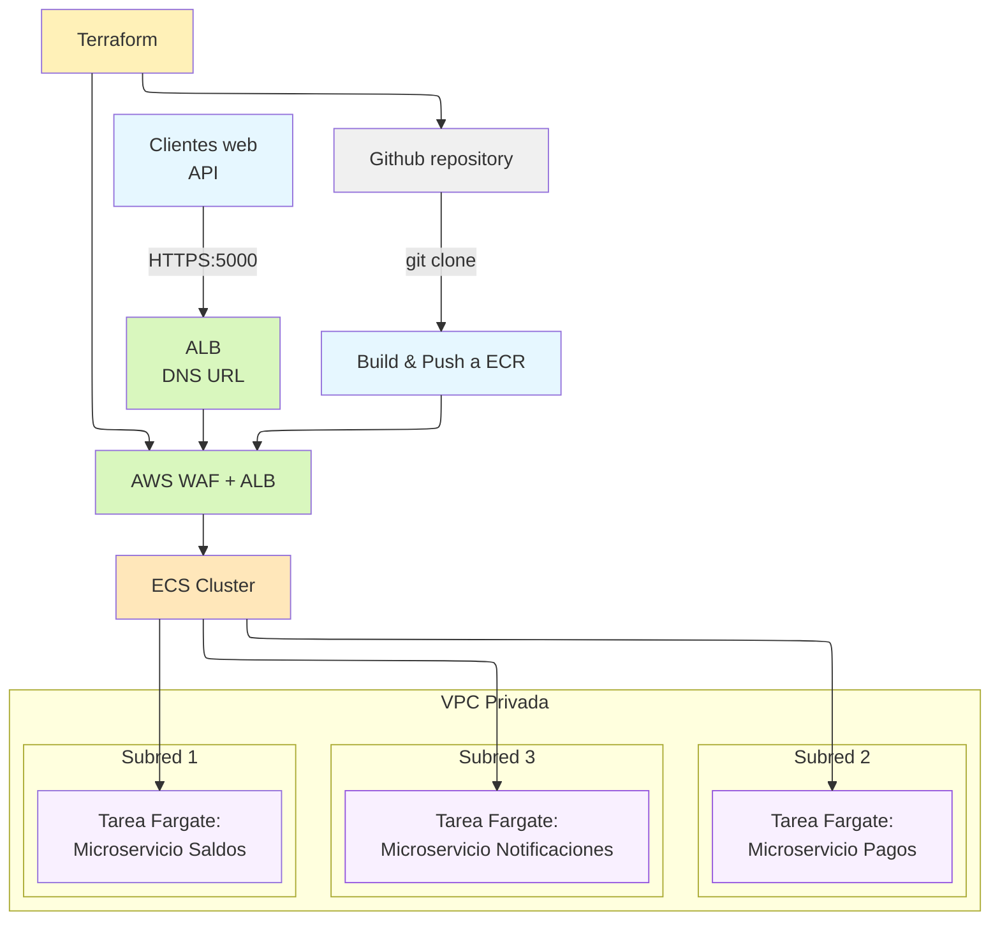
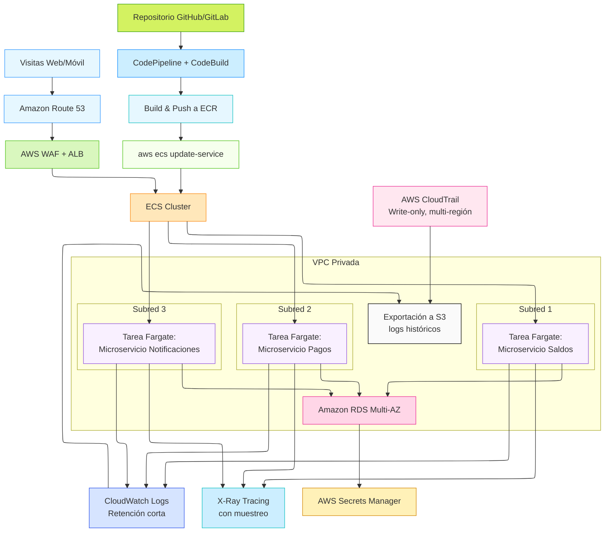

# 🏦 Microservicio de Saldos y Pagos – Banco Etheria (POC)

Este repositorio contiene una prueba de concepto (POC) para el microservicio principal del sistema de pagos del **Banco Etheria**. La aplicación simula las operaciones de **consulta de saldo**, **pagos** y **retiros** para clientes, y está diseñada para ejecutarse en contenedores bajo AWS ECS Fargate.

---

## 🚀 Objetivo de la POC

- Mostrar la viabilidad de una arquitectura basada en contenedores.
- Demostrar alta disponibilidad y bajo acoplamiento.
- Servir como guía para el despliegue automatizado (CI/CD).
- Simular comportamiento del sistema productivo de forma simple y clara.

---

## 🧱 Tecnologías utilizadas

- Python 3.13
- Flask
- Docker
- Simulación de almacenamiento en memoria (`dict`)

---

## 📦 Endpoints disponibles

### `GET /saldo/<usuario>`
Consulta el saldo actual de un usuario. Si el usuario no existe, se inicializa con **100000 CLP**.

📌 Ejemplo:
```bash
curl http://localhost:5000/saldo/usuario1
```

📤 Respuesta:
```json
{
  "usuario": "usuario1",
  "saldo": 100000
}
```

---

### `POST /pago`
Realiza un pago desde la cuenta del usuario. Si no existe, se inicializa con 100000 CLP.

📌 Payload:
```json
{
  "usuario": "usuario1",
  "monto": 5000
}
```

📤 Respuesta:
```json
{
  "usuario": "usuario1",
  "monto_pagado": 5000,
  "nuevo_saldo": 95000
}
```

---

### `POST /retiro`
Realiza un retiro con el mismo criterio que el pago, pero validando que no se exceda el saldo.

📌 Payload:
```json
{
  "usuario": "usuario2",
  "monto": 20000
}
```

📤 Posible respuesta:
```json
{
  "error": "El monto excede el saldo disponible.",
  "saldo_disponible": 15000
}
```

---

### `GET /health`
Verifica que el servicio esté corriendo correctamente.

---

## 🐳 Uso con Docker

### 1. Construir la imagen

```bash
docker build -t banco-etheria-poc .
```

### 2. Ejecutar localmente

```bash
docker run -p 5000:5000 banco-etheria-poc
```

---

## 🛡️ Consideraciones

- Esta aplicación no persiste datos (usa memoria volátil).
- Pensada exclusivamente para entornos de desarrollo y pruebas.
- Cumple con los pilares del **AWS Well-Architected Framework**: simplicidad, trazabilidad, disponibilidad y eficiencia.

---

## 📁 Estructura del repositorio

```
.
├── app.py                # Aplicación principal Flask
├── requirements.txt      # Dependencias
├── Dockerfile            # Imagen base para despliegue
└── README.md             # Esta documentación
```

## 🗺️ Arquitectura de la implementación del POC (Mermaid Diagram)



---

## 🗺️ Arquitectura completa del caso (Mermaid Diagram)



---
